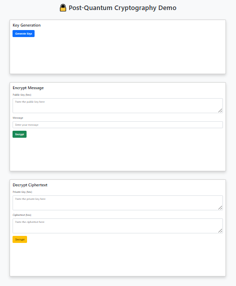
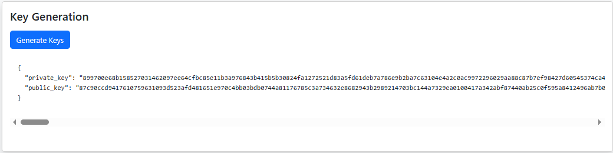
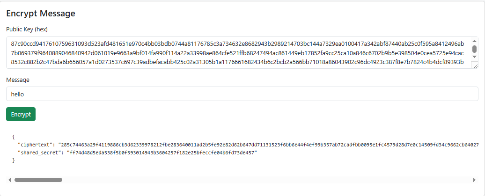
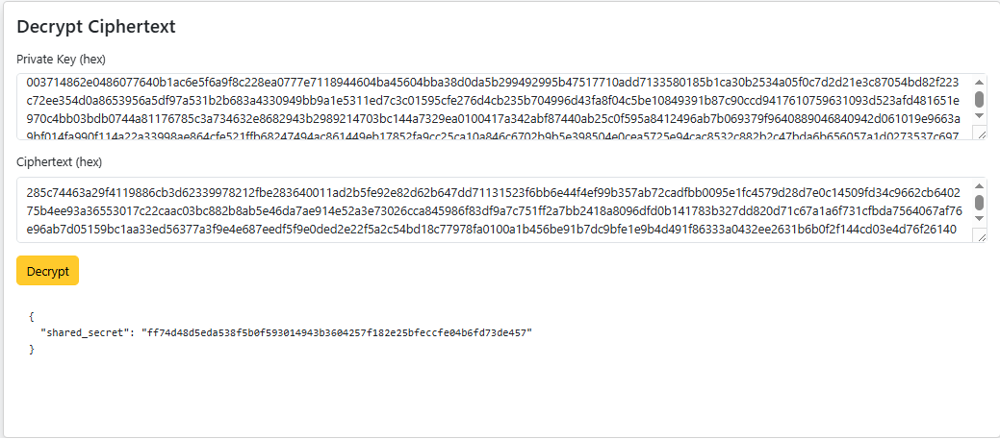

# 
# **Post-Quantum Cryptography Web Application - Readme file** 

# **Introduction:**

A secure Flask web application that demonstrates \*Post-Quantum Cryptography (PQC)\* using the Kyber512 encryption scheme. The app allows users to generate keys, encrypt messages, and decrypt ciphertext — all in a simple browser interface.

# **Live Demo:**

The app is deployed on PythonAnywhere for public access:

Live App: **https://sarib.pythonanywhere.com**

# **Features:**

* Post-Quantum key pair generation (Kyber512)  
* Encrypt plaintext messages using public keys  
* Decrypt ciphertext using private keys  
* Responsive Bootstrap UI  
* Secure with Flask-Talisman (CSP, HSTS, XSS headers)

# **Technologies Used**

* **Python 3.x**  
* **Flask** (web framework)  
* **pqcrypto** (post-quantum cryptography library)  
* **Bootstrap 5** (frontend styling)  
* **Flask-Talisman** (security headers)  
* **dotenv** (env config management)

# **App Screenshots**

* **Homepage/UI Overview**

* **Key Generation Result**	

* **Encrypted Message**	

* **Decryption Result**	

# **Setup Instructions**

## **1\. Clone the Repository**

* **git clone https://github.com/sarib95965/InfoSecProject**  
* **cd pqc-flask-app**

## **2\. Create Virtual Environment**

* **python3 \-m venv venv**  
* **source venv/bin/activate  \# On Windows: venv\\Scripts\\activate**

## **3\. Install Dependencies**

* **pip install \-r requirements.txt**

## **4\. Create .env File**

* **Create a .env file in the root directory with:**  
* **SECRET\_KEY=your-super-secret-key**  
* **You can also use .env.example as a template.**

## **5\. Run the App**

* **python app.py**  
* **Visit: http://127.0.0.1:5000**

# **Cryptography Details**

Kyber512 is one of the finalists in the NIST PQC standardization process.  
This app uses:

* **generate\_keypair()** — to create public/private keys  
* **encrypt()** — to encrypt a message using the public key  
* **decrypt()** — to retrieve the shared secret using the private key and ciphertext  
* Library used: **pqcrypto.kem.kyber512**

# **License**

**This project is part of the CS-3002 Information Security course. Intended for educational use only.**

# **Authors**

* **Student 1:** Ibrahim Abid  
  * **Roll Number:** i21-0298  
  * **Program:** BS AI, FAST NUCES Islamabad  
* **Student 2:** Sarib Ali  
  * **Roll Number:** i21-0283  
  * **Program:** BS AI, FAST NUCES Islamabad

